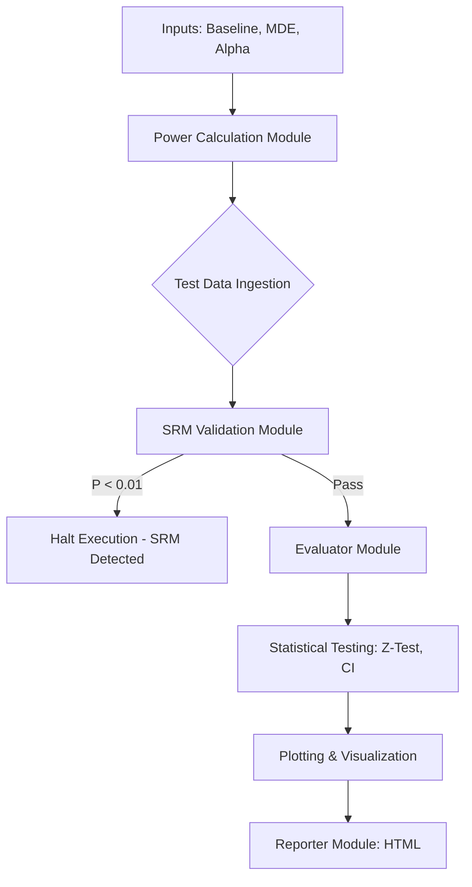

# 🏛 Architecture

StatTest-Pro is composed of independent, modular python files executing sequentially.

[← Back to Documentation Index](README.md)

## System Journey (Data Flow)

## Core Modules
1. `power.py`: Wraps `statsmodels.stats.power` to abstract theoretical power curves.
2. `srm.py`: Executes Chi-Square Goodness-of-Fit on incoming variant traffic ratios.
3. `evaluator.py`: Standardizes outputs for p-values, relative lifts, and confidence intervals.
4. `plotter.py` / `reporter.py`: Manages Seaborn generation and Jinja2 templating.
